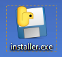
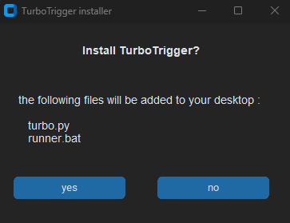
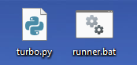

 

#### 1 -  now open the installer.exe

#### 2 - click yes

#### 3 - go to your Desktop and you will have 2 news files 
#### - runner.bat
#### - turbo.py

#### 4 - open runner.bat and it will launch the bot after entring your key

### and that should run the bot as usual

### from now to to run the bot you just do the steps in this section , so :
- copying the path
- pasting it in cmd after "cd"
- using "python" followed by the name of the script

