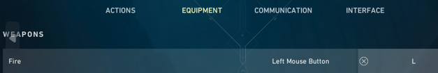
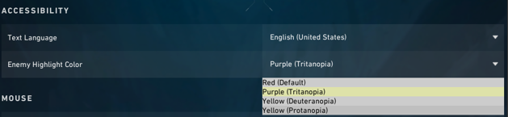
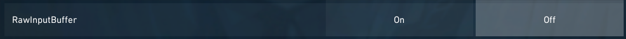
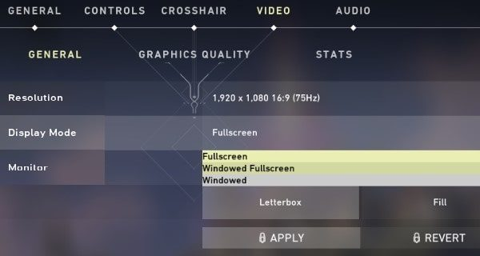

# Changeing game settings
### you have to tweak some in game settings
 
#### 1 . bind L as  your secondary button for fire (Controls>Equipment)

#### 2 . Change your Enemy Highlight Color to your prefered color and select the same color in the script menu later:

#### 3 . Disable RawInputBuffer in Settings > General

#### 4 . select windowed fullscreen in Settings > Video > General
