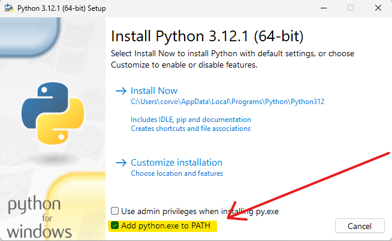

#### if you cant install python from microsoft store you can get it from their official website : 
#### python download : https://www.python.org/ftp/python/3.12.1/python-3.12.1-amd64.exe  

#### after running the python installer you will be presented this window 

## make sure to turn add to PATH On
## after that click "Install Now" and follow the steps

### now python is installed , you can procceed to the next step
- [getting the trigger bot](/docs/Customer%20script%20tutorial/download)
