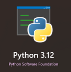
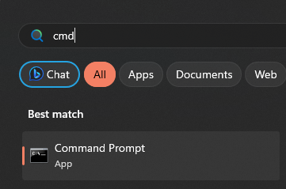

# installing the correct python version

### 1 . open microsoft store

### 2 . search "python 3.12" and install it 

#### after finishing installing it will open a black window , close it 

### 3 . open cmd 

### 4. in cmd type :
#### ``pip install mss numpy Pillow pyautogui keyboard requests packaging wmi customtkinter``
#### and tap enter

#### it will install some packages 